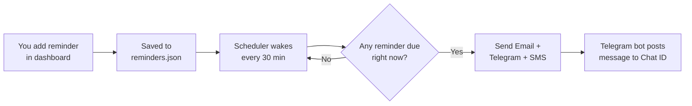

# How MedicineReminder Works

A small self-hosted .NET 8 app that sends medicine reminders over **Email**,
**Telegram**, and (optionally) **SMS** — at the date and time you choose in a
web dashboard. No hardcoded recipients: each reminder carries its own
recipient.

---

## 1. The big picture

```
                ┌─────────────────────────────┐
                │      Dashboard (web UI)      │
                │  add / view / delete reminder│
                └──────────────┬──────────────┘
                               │  writes
                               ▼
                        reminders.json
                               │  reads
                               ▼
                ┌─────────────────────────────┐
                │   Scheduler (every 30 min)   │
                │  "any reminder due right now?"│
                └──────────────┬──────────────┘
                               │  if due →
        ┌──────────────────────┼──────────────────────┐
        ▼                      ▼                      ▼
     Email                 Telegram                  SMS
   (MailKit)          (Telegram Bot API)          (Twilio)
```

- You add reminders in the **dashboard**. They are saved to `reminders.json`.
- A **scheduler** wakes up every 30 minutes, looks for reminders whose date is
  today and whose time falls in the current 30-minute window, and sends them.
- Each reminder is delivered on up to **three channels**: Email (always),
  Telegram (if a bot is configured), SMS (if Twilio is configured).

### The Telegram send flow



**Key point:** adding a reminder does **not** send instantly — the message
goes out at the reminder's date + time, when the 30-minute scheduler sees it
is due. For Telegram to actually fire you need: `Telegram__BotToken` set, a
valid **Chat ID** (typed in the dashboard or the default), and the recipient
must have pressed **Start** on your bot at least once.

---

## 2. The three run modes

The same app runs in three modes, chosen with `--mode=`:

| Mode | Command | What it does |
|------|---------|--------------|
| **dashboard** | `dotnet run -- --mode=dashboard` | Starts the web UI (default http://localhost:5080) to add/view/delete reminders. Can also run the scheduler in the background. |
| **daily** | `dotnet run -- --mode=daily` | Reads `reminders.json` and sends any reminder due right now. |
| **medicine** | `dotnet run -- --mode=medicine` | Sends the single fixed reminder from the `MedicineSettings` section (used for a simple monthly reminder). |

For normal day-to-day use you only need **dashboard** mode.

---

## 3. Adding a reminder (per-recipient, no hardcoding)

In the dashboard's **"➕ Add a reminder"** form you fill in:

| Field | Meaning |
|-------|---------|
| 📝 Description | Short label, e.g. "Blood pressure tablet" |
| 💊 Medicine name | e.g. "Amlodipine" |
| 💬 Reminder message | The text sent in the notification |
| 📅 Target date | The day it should be sent (UTC) |
| ⏰ Send time (UTC) | The time it should be sent |
| ✉️ To email *(optional)* | Send this reminder's email to a specific address. Blank = default receiver. |
| 📨 Telegram Chat ID *(optional)* | Send this reminder's Telegram message to a specific person. Blank = default chat. |

Each reminder can go to a **different person** — the recipient is stored with
the reminder, not hardcoded in the app.

---

## 4. How each channel works

### Email (always on)
Uses Gmail SMTP via MailKit. Sender credentials live in
`appsettings.Local.json` (git-ignored). Recipient = the reminder's
`ReceiverEmail`, or the default `EmailSettings:ReceiverEmail` if blank.

### Telegram (optional, free)
Uses the Telegram Bot API. It needs two things in config:
`Telegram:BotToken` and a `Telegram:ChatId`.

**Important Telegram rule:** a bot can only message someone who has **pressed
Start on the bot at least once**. You address people by their numeric
**Chat ID**, never by phone number.

To get someone's Chat ID:
1. Send them your bot link: `https://t.me/<your_bot_username>`
2. They tap **Start** (or send any message).
3. Open `https://api.telegram.org/bot<YOUR_BOT_TOKEN>/getUpdates`
4. Copy the `chat.id` number that appears.
5. Paste it into the reminder's **Telegram Chat ID** field.

### SMS (optional, paid — Twilio)
Uses the Twilio API. Unlike Telegram, SMS can be sent to **any phone number**
directly (no opt-in needed), but it costs money (~₹0.40 / message plus a
monthly number fee). Configure `Twilio:AccountSid`, `Twilio:AuthToken`,
`Twilio:FromPhoneNumber` in config. Recipient = the reminder's `ReceiverPhone`
or the default `Twilio:ToPhoneNumber`.

Every optional channel **fails silently** — if it isn't configured, or a send
fails, it is logged and skipped, and it never blocks the email.

---

## 5. Does Telegram need a GitHub Action? — No.

**Telegram does not require any GitHub Action.** The Telegram message is sent
*inside the app*, in the same code path as the email, every time a reminder
fires. As long as the app is running (dashboard mode with the scheduler, or a
`--mode=daily` / `--mode=medicine` run), Telegram goes out automatically.

There are two independent ways the reminders can fire:

1. **In-process scheduler (recommended, self-contained).**
   Run the app in dashboard mode with the scheduler enabled:
   ```powershell
   $env:Scheduler__Enabled = "true"
   dotnet run -- --mode=dashboard
   ```
   The app checks every 30 minutes and sends due reminders — email **and**
   Telegram **and** SMS — with no GitHub Actions involved at all.

2. **GitHub Actions cron (optional).**
   The repo also ships a workflow (`medicine-reminder.yml`) that can run the
   app on a schedule in the cloud. It *can* carry Telegram secrets, but this
   is **only needed if you don't keep the app running yourself**. If you use
   the dashboard/scheduler, you can ignore GitHub Actions entirely for
   Telegram.

**Summary:** GitHub Actions is just one optional trigger. Telegram delivery is
built into the app, so no Telegram-specific GitHub Action is required.

---

## 6. Running it locally

```powershell
cd c:\Users\v-kbandoju\MedicineReminder\MedicineReminder

# Start the dashboard + background scheduler
$env:Scheduler__Enabled = "true"
dotnet run -- --mode=dashboard
```

Then open the dashboard URL shown in the console (default
http://localhost:5080), add a reminder with a date/time and a Telegram Chat ID,
and leave the app running. At the chosen time the reminder is delivered.

---

## 7. Where configuration lives

| File | Purpose |
|------|---------|
| `appsettings.json` | Default (non-secret) settings, committed to git. |
| `appsettings.Local.json` | **Secrets** (Gmail password, Telegram token, etc.). Git-ignored. |
| Environment variables | Override any setting using `Section__Property` (e.g. `Telegram__ChatId`). Used for cloud/GitHub Actions. |
| `reminders.json` | The list of reminders the dashboard writes to. |

Precedence (later wins): `appsettings.json` → `appsettings.Local.json` →
environment variables → command line.

> 🔒 **Security reminder:** never commit real secrets. Keep them in
> `appsettings.Local.json` (already git-ignored) or environment variables.
